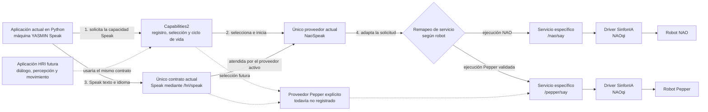

# Semana 7: verificación técnica inicial en NAO y Pepper

## Objetivo

Verificar desde ROS 2 el acceso real a sensores, actuadores y servicios de NAO y Pepper, identificar los adaptadores disponibles y registrar limitaciones antes de integrarlos como proveedores de capacidades. En ambas plataformas se comprobaron publicaciones de sensores seleccionados y voz; la cadena Capabilities2 con el contrato común `Speak` se validó físicamente en los dos robots.

## Entorno comprobado

- Fechas: 16 y 17 de septiembre de 2026.
- Computador del laboratorio: Ubuntu 24.04.2, arquitectura x86_64 y ROS 2 Jazzy.
- Middleware: Cyclone DDS, descubrimiento `SUBNET`.
- Workspace usado: `~/Documents/naoqi/naoqi_ws`.
- Robots comprobados: NAO V6.0 con NAOqi 2.8.6.23 y Pepper; la versión de NAOqi de Pepper no se registró en esta prueba.
- La IP y los identificadores físicos del robot se omiten de esta nota.
- Capabilities2 no intervino en la adquisición inicial de sensores ni en la primera llamada directa de voz. Posteriormente se ejecutó una segunda prueba integral con Capabilities2 y el proveedor `NaoSpeak`, registrada más adelante.

## Arquitectura portable propuesta

La arquitectura separa **qué capacidad necesita la aplicación** de **cómo la ejecuta cada robot**. La aplicación HRI no debería depender directamente de nombres particulares como `/nao/say`, clases de NAOqi o detalles físicos de Pepper. En su lugar, usa un contrato común. Capabilities2 registra las implementaciones disponibles, selecciona un proveedor y administra su inicio y liberación. El proveedor traduce la solicitud común al servicio o driver específico de la plataforma.

En consecuencia, “enviar la misma instrucción a otro robot” significa conservar la solicitud común de la aplicación y cambiar el proveedor configurado. No significa que todos los robots tengan automáticamente la misma API. Cada plataforma necesita un adaptador que cumpla el contrato común y encapsule sus diferencias.

### Qué significa cada elemento y qué existe actualmente

| Elemento | Significado en la arquitectura | Implementación disponible actualmente | Posible evolución |
| --- | --- | --- | --- |
| Aplicación | Componente que decide **qué** quiere hacer y solicita una capacidad sin conocer la API particular del robot | Existe una primera aplicación Python en `hri_reference_app`: una máquina YASMIN que solicita `Speak` y libera la capacidad en éxito o error. Los scripts físicos y simulados anteriores se conservan como probes de diagnóstico | Ampliar la máquina YASMIN para combinar diálogo, percepción y movimiento |
| Contrato común | Interfaz estable que todas las implementaciones de una misma capacidad deben cumplir | Existe un solo contrato propio: `hri_capability_interfaces/srv/Speak`, expuesto como `/hri/speak`. Recibe `text` y `language`; responde `success`, `provider` y `message` | Contratos diferentes para `Transcribe`, `DetectPerson`, `Navigate`, `DetectObstacle` o `ExecuteGesture` |
| Capabilities2 | Gestor que registra los contratos y proveedores, activa el proveedor seleccionado y lo libera cuando deja de usarse | El `launch` de la aplicación inicia el servidor, carga las especificaciones instaladas, establece el vínculo, solicita `NaoSpeak` y lo libera | Mantener varios proveedores registrados y escogerlos mediante configuración |
| Proveedor | Adaptador concreto que **implementa un contrato común** usando una tecnología o plataforma determinada | Existe un solo proveedor propio: `hri_naoqi_providers/NaoSpeak`. Atiende `/hri/speak` y llama `/nao/say` con voz no animada y síncrona | Otro proveedor de `Speak` para Pepper, Piper u otra salida de voz; todavía no está implementado |
| Servicio o driver específico | Mecanismo no portable al que delega el proveedor; no es una capa adicional que la aplicación deba conocer | `/nao/say` y `/pepper/say` del módulo SinfonIA producen la voz física. El destino se seleccionó mediante remapeo ROS 2 en la prueba de Pepper | Convertir la selección del destino en configuración explícita y registrar un proveedor con identidad propia para Pepper |
| Robot | Plataforma física que finalmente ejecuta la capacidad | NAO y Pepper completaron el recorrido mediante Capabilities2. En Pepper se reutilizó temporalmente `NaoSpeakRunner` mediante remapeo | Sustituir el remapeo diagnóstico por un proveedor Pepper explícito sin modificar la aplicación |



Las flechas continuas representan el recorrido arquitectónico ya implementado. El contrato y el proveedor fueron validados físicamente con NAO y Pepper mediante el probe anterior; la nueva aplicación YASMIN recorrió esas mismas capas con servicios de robot simulados y aún requiere repetición física. En todos los casos, Capabilities2 administró el mismo proveedor `hri_naoqi_providers/NaoSpeak`; para Pepper, ROS 2 remapeó internamente `/nao/say` a `/pepper/say`. La aplicación siguió solicitando `/hri/speak`, por lo que no cambió su lógica. Las flechas discontinuas representan la evolución pendiente hacia una aplicación HRI con varias capacidades y un proveedor Pepper con nombre y configuración propios. Capabilities2 administra el proveedor, pero no reemplaza al driver ni transporta por sí mismo el texto hasta NAOqi.

### Responsabilidad de cada capa

| Capa | Responsabilidad | Lo que debe permanecer independiente |
| --- | --- | --- |
| Aplicación u orquestación | Decide cuándo hablar, escuchar, detectar una persona, navegar o ejecutar un gesto | APIs particulares de NAO, Pepper o un servicio concreto |
| Contratos comunes | Define entradas, resultados y errores compartidos, como `Speak(text, language)` | Implementación interna del proveedor |
| Capabilities2 | Registra proveedores, selecciona uno, lo inicia y lo libera | Lógica física del robot y procesamiento de la capacidad |
| Proveedores o adaptadores | Implementan el contrato común y traducen hacia un servicio, tópico, acción o SDK específico | Decisiones de alto nivel de la aplicación |
| Servicios y drivers específicos | Acceden a sensores, actuadores, NAOqi o algoritmos externos | Contrato portable consumido por la aplicación |

Un **proveedor** no es el robot ni cualquier paquete ROS 2. Es la implementación concreta de una capacidad común. Actualmente solo existe el proveedor `hri_naoqi_providers/NaoSpeak`, que implementa `Speak` usando el nombre interno `/nao/say`; su clase ejecutora es `NaoSpeakRunner`. Para la prueba diagnóstica con Pepper, ese nombre se remapeó a `/pepper/say`, por lo que no se creó un segundo proveedor. Un futuro proveedor de Piper podría implementar el mismo contrato usando `piper_ros`. En cambio, `whisper_ros` correspondería a otra capacidad, como `Transcribe` o `Listen`, no a `Speak`.

### Primer incremento y evidencia inicial de portabilidad

El primer incremento se limita a una capacidad común, ejecutada en dos plataformas físicas:

```text
Aplicación → /hri/speak → proveedor NaoSpeak → /nao/say → SinfonIA/NAOqi → NAO
                                            ↳ remapeo a /pepper/say → SinfonIA/NAOqi → Pepper
```

El incremento comenzó con un script de prueba y ahora dispone de una primera máquina YASMIN. Ambas recorren las mismas capas con el caso mínimo `Speak`; la nueva aplicación agrega estados explícitos para establecer el vínculo, solicitar la capacidad, hablar y liberarla. La evidencia física registrada en esta nota corresponde al probe anterior, mientras que la aplicación YASMIN tiene por ahora evidencia simulada.

La ejecución aprobada en Pepper aporta una primera evidencia de portabilidad: se conservó la misma aplicación, el contrato `/hri/speak` y el proveedor administrado por Capabilities2; solo se configuró el destino del servicio mediante remapeo. Esto demuestra reutilización cuando dos plataformas exponen servicios compatibles. No constituye todavía el diseño final para varias plataformas, porque el resultado continúa identificando al proveedor como `NaoSpeak`. La siguiente mejora consiste en registrar un proveedor Pepper explícito o parametrizar formalmente el proveedor compartido, sin cambiar la lógica de la aplicación.

El mismo patrón puede extenderse a las demás familias caracterizadas en la semana 6:

- `Transcribe` o `Listen`: proveedor basado en `whisper_ros` y una adaptación del audio del robot.
- `DetectPerson`: proveedor basado en MediaPipe o YOLO, con una representación común de las detecciones.
- `ExecuteGesture`: proveedor basado en primitivas NAOqi o, si resulta viable, planificación y control mediante MoveIt 2.
- `Navigate` y `DetectObstacle`: proveedores que encapsulen las diferencias de sensores, locomoción y servicios de cada plataforma.

Estas extensiones siguen siendo propuestas hasta implementar sus contratos, proveedores y pruebas. Los cortes de voz con NAO y Pepper validan primero el mecanismo arquitectónico con un caso pequeño y observable.

## Primera aplicación portable con YASMIN

Se añadió el paquete ROS 2 `hri_reference_app`. La aplicación se implementó en Python para facilitar su futura integración con percepción y diálogo; el runner `NaoSpeakRunner` permanece en C++ porque Capabilities2 lo carga mediante `pluginlib`. La máquina de estados ejecuta este flujo:

```text
ESTABLISH_BOND → USE_SPEAK → SPEAK → FREE_AFTER_SUCCESS → application_succeeded
                                  ↘ FREE_AFTER_FAILURE → application_failed
```

Un único `launch` inicia Capabilities2, carga automáticamente el contrato y el proveedor instalados, y recibe `robot:=nao` o `robot:=pepper`. La lógica de la aplicación no cambia entre plataformas; para Pepper, el proceso de Capabilities2 remapea únicamente el destino interno `/nao/say` hacia `/pepper/say`.

La verificación local en Docker con ROS 2 Jazzy y YASMIN 6.1.1 produjo estos resultados:

| Escenario | Resultado |
| --- | --- |
| Servicio `/nao/say` simulado | `application_succeeded`, proveedor `NaoSpeak`, mensaje `mock_nao_spoken`, liberación `true` |
| Servicio `/pepper/say` simulado | Misma aplicación y proveedor, mensaje `mock_pepper_spoken`, liberación `true` |
| Servicio del robot ausente | `application_failed`, mensaje `nao_say_unavailable`, liberación `true` |
| Plataforma no soportada | El `launch` rechazó el valor antes de iniciar los nodos |

Los servicios simulados confirmaron que el proveedor recibió texto e idioma y tradujo la solicitud con `animated=false` y `asynchronous=false`. También se compiló el paquete con `colcon`, se validó la sintaxis Python y se construyó el entorno Docker versionado. `colcon test` no encontró pruebas registradas en el paquete; por tanto, la evidencia funcional procede de las ejecuciones integrales descritas y queda pendiente automatizarlas como suite.

La siguiente comprobación en el laboratorio consiste en arrancar el driver correspondiente y ejecutar:

```bash
ros2 launch hri_reference_app speak_demo.launch.py robot:=nao
ros2 launch hri_reference_app speak_demo.launch.py robot:=pepper
```

Esta repetición física permitirá sustituir la evidencia simulada de la aplicación YASMIN sin confundirla con las pruebas físicas ya aprobadas del contrato y el proveedor.

## Arranque

El script disponible en el laboratorio contiene:

```bash
source install/setup.bash
ros2 launch naoqi_bringup2_sinfonIA naoqi_full_bringup.launch.py nao_ip:=$NAO_IP
```

Antes del arranque se comprobó respuesta ICMP sin pérdidas en tres paquetes y conexión TCP exitosa al puerto NAOqi 9559. El proceso inició seis nodos:

- `/nao/naoqi_driver`
- `/nao/naoqi_manipulation_node`
- `/nao/naoqi_miscellaneous_node`
- `/nao/naoqi_navigation_node`
- `/nao/naoqi_perception_node`
- `/nao/naoqi_speech_node`

### Efectos del arranque

El `full_bringup` no es un arranque pasivo: habilitó parpadeo autónomo, deshabilitó la vida autónoma, ordenó la postura `Stand`, deshabilitó *basic awareness* y detuvo el *tracker*. Debe ejecutarse con el robot supervisado, estable y con espacio libre. No se debe afirmar que iniciar el driver carece de movimiento.

## Interfaces observadas en NAO

El grafo ROS 2 expuso, entre otras, las siguientes interfaces:

| Familia | Interfaces principales |
| --- | --- |
| Imagen | `/nao/camera/front/image_raw`, `/nao/camera/bottom/image_raw` y `camera_info` |
| Audio | `/nao/mic`, `/nao/mic_stamped`, `/nao/mic_info` |
| Estado | `/nao/joint_states`, `/nao/odom`, `/tf`, `/nao/battery_percentage`, `/nao/info` |
| Distancia | `/nao/sonar/left`, `/nao/sonar/right` |
| Movimiento | `/nao/cmd_vel`, `/nao/goal_pose`, `/nao/joint_trajectory` y servicios de navegación/manipulación |
| Voz | `/nao/speech`, servicio `/nao/say` y acción `/nao/listen` |

La presencia de una interfaz demuestra disponibilidad en el grafo, no por sí sola datos correctos ni comportamiento físico válido.

## Datos comprobados

Los siguientes resultados fueron observados con el robot físico conectado:

| Comprobación | Resultado |
| --- | --- |
| Información del robot | Se recibió un mensaje; identificadores físicos omitidos |
| Batería | 21 % durante la prueba |
| Estados articulares | Aproximadamente 4,24 Hz |
| Cámara frontal RGB | Aproximadamente 4,18 Hz |
| Micrófono con sello temporal | Aproximadamente 11,83 Hz |
| Odometría | Aproximadamente 10,73 Hz |
| Sonar izquierdo | Mensaje recibido; 0,24 m con mínimo declarado de 0,25 m |
| Sonar derecho | Mensaje recibido; 0,26 m con mínimo declarado de 0,25 m |

La lectura izquierda está fuera del intervalo declarado por el propio mensaje y debe tratarse como inválida o fuera de rango hasta revisar la convención del driver. Estas dos muestras no demuestran detección ni evitación de obstáculos. La frecuencia observada de la cámara fue menor que la configuración documental nominal; se registra como diferencia por investigar, no como fallo demostrado.

## Interfaces y datos comprobados en Pepper

El *bringup* de Pepper expuso ocho nodos: el driver principal, los módulos de interfaz, manipulación, funciones misceláneas, navegación, percepción y voz, además de `web_video_server`. El grafo incluyó las siguientes familias:

| Familia | Interfaces principales |
| --- | --- |
| Imagen | Cámaras frontal, inferior y de profundidad, con `image_raw`, `camera_info` y transportes derivados |
| Audio | `/pepper/mic`, `/pepper/mic_stamped` y `/pepper/mic_info` |
| Estado | `/pepper/joint_states`, `/pepper/odom`, `/tf`, `/pepper/battery_percentage` y `/pepper/info` |
| Distancia | `/pepper/laser`, `/pepper/sonar/front` y `/pepper/sonar/back` |
| Movimiento | `/pepper/cmd_vel`, `/pepper/goal_pose`, `/pepper/joint_trajectory` y servicios de navegación/manipulación |
| Voz | `/pepper/speech`, servicio `/pepper/say` y acción `/pepper/listen` |
| Tablet | Servicios para mostrar texto, imágenes, video, páginas web y flujos de tópicos, además de entrada del usuario |

Las pruebas de solo lectura produjeron estos resultados:

| Comprobación | Resultado observado |
| --- | --- |
| Información del robot | Se recibió un mensaje; identificadores físicos omitidos |
| Batería | 79 % durante la prueba |
| Estados articulares | Aproximadamente 1,25 Hz |
| Cámara frontal RGB | Aproximadamente 1,30 Hz en una observación de 30 segundos |
| Cámara inferior RGB | Aproximadamente 0,51 Hz |
| Cámara de profundidad | Aproximadamente 0,94 Hz |
| Micrófono con sello temporal | Aproximadamente 11,65 Hz |
| Odometría | Aproximadamente 5,12 Hz |
| Láser | Aproximadamente 2,08 Hz |
| Sonar frontal | 1,14 m, dentro del intervalo declarado de 0,25 a 2,55 m |
| Sonar trasero | 4,76 m, fuera del máximo declarado de 2,55 m |
| Idioma y volumen | `Spanish` y 70 % |

La lectura del sonar trasero debe interpretarse como fuera de rango o ausencia de eco, no como una distancia física válida de 4,76 m. Las tres cámaras están configuradas documentalmente a 10 Hz, pero sus frecuencias observadas fueron considerablemente inferiores. La primera ventana de diez segundos no recibió datos de la cámara frontal; una segunda observación de treinta segundos confirmó el suscriptor y la publicación. Esto se registra como comportamiento transitorio o de rendimiento por investigar, no como fallo físico.

Al inicio, una terminal podía descubrir el publicador de audio pero no resolver `audio_common_msgs`; con el entorno del workspace correctamente disponible, el paquete, su interfaz y los mensajes se resolvieron y el audio se midió a 11,65 Hz. Por tanto, la incidencia correspondió al entorno del cliente ROS 2 y no al micrófono ni a la desactivación de la vida autónoma.

## Prueba de voz mediante ROS 2

Se confirmó primero que el idioma activo era `Spanish`:

```bash
ros2 service call /nao/get_language naoqi_bridge_msgs/srv/GetString "{}"
```

Luego se ejecutó una solicitud no animada y síncrona:

```bash
ros2 service call /nao/say naoqi_utilities_msgs/srv/Say "{text: 'Hola, esta es una prueba desde ROS 2.', language: 'Spanish', animated: false, asynchronous: false}"
```

El servicio respondió `success=True` y `Synchronous say command finished.` El autor confirmó auditivamente que NAO pronunció la frase. Por tanto, queda verificada la cadena:

```text
cliente ROS 2 → /nao/say → adaptador naoqi_speech → NAOqi → voz física de NAO
```

Esta prueba es distinta de la llamada directa previa Docker → NAOqi. Por sí sola no demuestra selección ni ciclo de vida mediante Capabilities2; esa integración se comprobó posteriormente en la siguiente prueba.

## Prueba integral con Capabilities2 y `NaoSpeak`

Después de compilar el overlay `portable_hri_ws`, ROS 2 localizó el paquete `hri_naoqi_providers` y se confirmó que el driver seguía exponiendo `/nao/say` con el tipo `naoqi_utilities_msgs/srv/Say`. Desde el computador del laboratorio se ejecutó:

```bash
cd ~/Documents/portable_hri_ws
source ~/Documents/naoqi/naoqi_ws/install/setup.bash
source ~/Documents/portable_hri_ws/install/setup.bash
python3 src/portable-hri-reference-system/tests/capabilities_nao_speak_physical.py
```

El script realizó el siguiente recorrido:

```text
aplicación de prueba → Capabilities2 → NaoSpeakProvider → /hri/speak
→ /nao/say → adaptador SinfonIA → NAOqi → voz física de NAO
```

En concreto, el script inició un servidor temporal de Capabilities2, registró el contrato `hri_capability_interfaces/Speak` y el proveedor `hri_naoqi_providers/NaoSpeak`, estableció el vínculo de uso, solicitó la capacidad con ese proveedor preferido, esperó su activación y llamó `/hri/speak`. Al terminar solicitó la liberación de la capacidad y detuvo el servidor temporal.

La ejecución comenzó el 16 de septiembre de 2026 a las 19:56:41 UTC y produjo estos resultados:

| Evidencia | Resultado |
| --- | --- |
| Frase solicitada | “Hola, esta es una prueba con Capabilities2.” |
| Idioma | `Spanish` |
| Proveedor reportado | `hri_naoqi_providers/NaoSpeak` |
| Respuesta del backend | `Synchronous say command finished.` |
| Éxito técnico | `true` |
| Confirmación auditiva del observador | `true` |
| Resultado integral | `passed: true` |

El autor confirmó que escuchó al NAO pronunciar la frase. Por tanto, queda validado físicamente este primer corte vertical de la arquitectura:

```text
Speak común → gestión de Capabilities2 → proveedor específico de NAO → servicio ROS 2 → robot
```

El resultado demuestra que la aplicación puede depender del contrato común y que Capabilities2 puede seleccionar, iniciar y liberar el proveedor real de NAO. La prueba posterior con Pepper reutilizó la misma solicitud y añadió una primera evidencia de portabilidad entre robots.

## Prueba integral con Capabilities2 en Pepper mediante remapeo

Con el driver de Pepper activo y `/pepper/say` disponible, se actualizó el sistema de referencia y se ejecutó la misma aplicación de prueba indicando únicamente el servicio físico de destino:

```bash
cd ~/Documents/portable_hri_ws
source ~/Documents/naoqi/naoqi_ws/install/setup.bash
source ~/Documents/portable_hri_ws/install/setup.bash
python3 src/portable-hri-reference-system/tests/capabilities_nao_speak_physical.py --backend-service /pepper/say --text "Hola, esta es una prueba de Capabilities2 en Pepper."
```

El script conservó `/hri/speak`, el contrato `hri_capability_interfaces/Speak` y el proveedor `hri_naoqi_providers/NaoSpeak`. Al iniciar el proceso temporal de Capabilities2, remapeó el nombre interno `/nao/say` a `/pepper/say`. El recorrido comprobado fue:

```text
aplicación de prueba → Capabilities2 → NaoSpeakRunner → /hri/speak
→ remapeo /nao/say a /pepper/say → adaptador SinfonIA → NAOqi → voz física de Pepper
```

El autor confirmó que la ejecución terminó correctamente y que escuchó a Pepper pronunciar la frase. El resultado final de la prueba indicó:

| Evidencia | Resultado |
| --- | --- |
| Robot identificado por el script | `Pepper` |
| Servicio físico | `/pepper/say` |
| Proveedor reportado | `hri_naoqi_providers/NaoSpeak` |
| Uso de remapeo | `true` |
| Éxito técnico | `true` |
| Confirmación auditiva del observador | `true` |
| Resultado integral | `passed: true` |

Esta prueba demuestra que la aplicación no necesitó conocer `/pepper/say` ni cambiar la solicitud común. También confirma que un mismo proveedor puede reutilizarse cuando los servicios de las plataformas tienen el mismo tipo y semántica. No debe interpretarse como la existencia de `PepperSpeak`: el nombre `NaoSpeak` sigue apareciendo porque todavía hay un único proveedor registrado. El remapeo constituye una validación diagnóstica de portabilidad, no la solución nominal definitiva.

## Incidencias y límites

- Durante el inicio apareció una vez `Could not compute NAO Footprint: no transform is possible`. El sistema continuó y quedó listo, pero la causa y su impacto en navegación están pendientes.
- No se inspeccionó visualmente el contenido de las imágenes; se comprobó recepción y frecuencia.
- No se evaluaron calidad/formato del audio, exactitud de odometría o calibración de sensores.
- No se enviaron órdenes deliberadas de locomoción o trayectorias. La postura `Stand` fue parte automática del *bringup*.
- MoveIt 2 está instalado en el computador, pero no se observó una acción `FollowJointTrajectory` en los grafos inspeccionados; su integración con los tópicos de trayectoria no está demostrada.
- MediaPipe no estuvo activo. Capabilities2 solo intervino en la prueba integral de voz descrita arriba, no en la caracterización de sensores.
- Durante dos solicitudes de voz de Pepper, `naoqi_speech_node` detectó una sesión NAOqi desconectada y se reconectó automáticamente. Las solicitudes finalizaron, pero la intermitencia debe vigilarse en pruebas prolongadas.
- `web_video_server` recibió solicitudes HTTP ajenas al flujo normal de la prueba y compatibles con exploración automatizada de red. No demuestran una intrusión, pero conviene iniciar Pepper con `launch_video_server:=false` cuando no se requiera transmisión web.
- NAO tenía 21 % de batería durante su prueba; no corresponde ejecutar movimiento con esa medición sin cargarlo. Pepper registró 79 %.

## Resultado y continuación

**Resultado aprobado para el bloque básico de acceso en NAO y Pepper:** en ambos robots se comprobaron el grafo ROS 2, publicaciones de sensores seleccionados, consultas de estado y voz real tanto directa como mediante el contrato portable cuando correspondía. Pepper añadió evidencia de cámaras frontal, inferior y de profundidad, micrófono, odometría, láser y sonares. La semana 7 no queda cerrada en su totalidad: faltan inspeccionar el contenido y la calidad de imagen/audio, validar exactitud y calibración, y evaluar de manera supervisada controladores y actuadores de movimiento.

El proveedor real `NaoSpeak` queda aprobado en tres escenarios: pasó 9/9 comprobaciones locales contra `/nao/say` simulado, 9/9 contra `/pepper/say` simulado mediante remapeo y las dos pruebas físicas supervisadas con NAO y Pepper. Además, la primera aplicación YASMIN completó las rutas simuladas para ambos robots y liberó la capacidad también ante ausencia del servicio. Esto cierra los recorridos Capabilities2 → proveedor → robot para `Speak` en ambas plataformas y deja pendiente únicamente la repetición física del nuevo orquestador YASMIN. También permanecen pendientes formalizar la identidad o parametrización del proveedor para Pepper, implementar las demás capacidades y resolver el fallo conocido de Capabilities2 al reportar un proveedor inexistente; este último no fue corregido ni reevaluado por las pruebas físicas.

Revisión documental: la explicación completa de la arquitectura portable se trasladó desde la nota de semana 6 y se ubicó antes de las pruebas físicas, junto con sus definiciones, responsabilidades, diagrama, primer incremento y criterio de portabilidad. Los resultados de NAO y Pepper fueron transcritos de las salidas y confirmaciones suministradas por el autor, sin registrar IP ni identificadores físicos. La prueba de Pepper mediante Capabilities2 se presenta como aprobada por remapeo y se distingue expresamente de un futuro proveedor `PepperSpeak`. La aplicación actual se actualizó de probe a máquina YASMIN y su evidencia simulada se separó de la validación física todavía pendiente. No hay type-checker ni ESLint aplicable a esta actualización exclusivamente Markdown.
